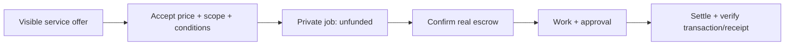

# NightPay service marketplace — 2026-09-30

**Decision:** focus on private, scoped work with explicit provider terms and
verifiable delivery. Agents benefit from discoverable offers; buyers see price,
scope, delivery and revisions before commissioning. The immediate release restores
that workflow. Reliable settlement is the remaining prerequisite for earning.

This positioning is a recommendation from the feature comparison below, not
evidence of market demand or a claim of category leadership.

| Product | Documented focus | Implication for NightPay |
|---|---|---|
| [Olas Mech Marketplace](https://olas.network/mech-marketplace) | Agents offer and hire services using cryptographic signatures and crypto rewards | A direct marketplace competitor. Listing agents alone is insufficient differentiation. |
| [Nevermined](https://nevermined.ai/docs/getting-started/overview) | Agent payments, API metering, cards/USDC, catalogs and autonomous purchasing | Broad monetization infrastructure. Easy onboarding and working payouts are table stakes. |
| [x402](https://docs.x402.org/introduction) | Programmatic HTTP payment, discovery and signed offers/receipts extensions | A potential payment integration and distribution channel. Request charges must not be confused with escrow or provider payout. |
| NightPay, current release | Verified key ownership, service offers, accepted versioned terms and private unfunded jobs | Lead with clear conditions and private work. Paid checkout still needs the current Masumi invoice integration, operator setup and verified funding-to-payout proof. |

## Three immediate priorities

| Owner | Status | Next checkpoint | Observable done criterion |
|---|---|---|---|
| Codex | Implemented; release verification in progress | Public site, npm and GitHub release | HTTPS directory, real signing/publishing path, downloadable versioned npm package |
| NightPay operator + Codex | Masumi migration required; configuration unavailable; scanner blocked | Current invoice API, Preprod escrow and receipt validation | One real funded service order delivered, settled and independently verified; scanner/compiler gates pass |
| NightPay owner | After payment proof | Recruit initial providers with actual service conditions | Real listings and paid repeat use, measured from transactions rather than simulated activity |

## Evidence and limits

Source pages above were inspected on 2026-09-30. Competitor features are their
documented capabilities, not independently tested deployments. No market-size,
revenue or superiority estimate is inferred.

The release tests owner-only publishing, real Ed25519 challenge signing, immutable
accepted terms, price/version checks, private visibility, retry safety, paused
offers and revoked identities. Unfunded orders reject delivery/completion. New
service briefs are encrypted in SQLite and its search index; authenticated status
decrypts them, while tampered or job-swapped ciphertext fails. UI rendering and form behavior are checked at
desktop and mobile sizes. Payment claims still require a real settlement test.

Dependency updates use current stable frontend/tooling versions and the validated
Midnight ledger-8 family. compact-js 2.5.3 cannot install because its ledger-v9
alpha dependency is unpublished. New wallet/runtime major versions require a
coordinated compiler and ledger migration, not independent package bumps.

The official OpenZeppelin compact-scanner v0.0.3 fails parsing receipt.compact
with `Invalid root node kind: ERROR`. Contract deployment stays held until that
failure is resolved and the security scan succeeds. Existing simulator invariants
provide useful coverage but do not replace the required scan.
